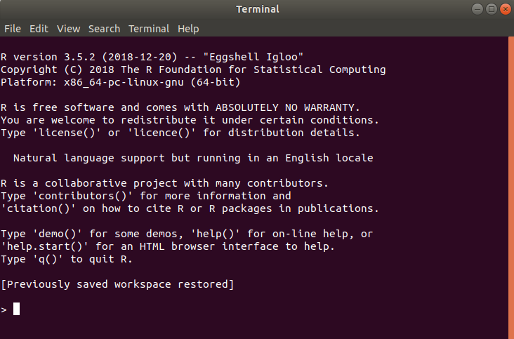
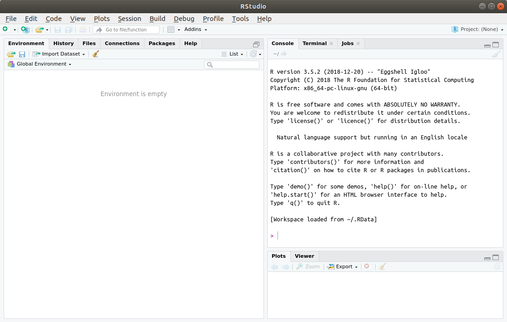

```{r setup, include=FALSE}
options(htmltools.dir.version = FALSE)
require(plotly)
require(tidyverse)
```

# What's R?

.pl[
- R is a programming language and free software environment for statistical computing and graphics supported by the R Foundation for Statistical Computing.
- Is an implementation of the S programming language combined with lexical scoping semantics, inspired by Scheme.
- Created by Ross Ihaka and Robert Gentleman at the University of Auckland, New Zealand, and currently developed by the R Development Core Team. <sup>1</sup>
- The most common integrated development environment (IDE) is RStudio. The one we are going to use

.footnote[
[1] Wikipedia
]
]

.pr[
```{r, echo=F, out.width="60%", eval=FALSE}
knitr::include_graphics("https://www.r-project.org/logo/Rlogo.png")
```

]

---

# Installing R and RStudio IDE

## Install R base

1. Go to [The R Project for Statistical Computing](https://www.r-project.org/) official website
1. Search for the **download R** link
1. Select the closest Comprehensive R Archive Network (CRAN) mirror (it won't make much difference if you choose another one)
1. Select the file according to your OS

## Install IDE

1. Go to [RStudio](https://www.rstudio.com/)
1. Choose the RStudio Desktop Open Source License
1. Then again, the option for your specific OS
1. Execute both

---

# R Console

.pl[
```{r, out.width="100%", echo=F}

```
]

.pr[
Here it is possible to execute all kind of build-in functions. Give it a try
```{r}
1+1
log(0)
"Hello World"
TRUE*TRUE
```
]

---

# RStudio interface

```{r, out.width="100%", echo=FALSE, out.width="70%", fig.align='center'}

```

One can change the layout by following (among other things): `Tools-> Global options -> Panel layout`
---

# Creating a project

```{r, fig.align='center', echo=FALSE}
knitr::include_graphics("https://media.giphy.com/media/109fP7pua6Osgw/giphy.gif")
```

RStudio projects make it straightforward to divide your work into multiple contexts, each with their own working directory, workspace, history, and source documents.<sup>1</sup>

.footnote[
[1] [Rstudio](https://support.rstudio.com/hc/en-us/articles/200526207-Using-Projects)
]


---

# Basic commands

.pl[
Getting help
```{r, eval=FALSE}
?glm
```

Install a package
```{r, eval=FALSE}
install.packages("plm")
```

Load a package
```{r, eval=FALSE}
# Into the session
require("plm")
library("plm")
# An specific function
plm::vcovHC()
```

Load a build-in dataset
```{r}
data(mtcars)
```
]

.pr[
Current working directory
```{r, eval=FALSE}

getwd()
```


Change current WD
```{r, eval=FALSE}
setwd()
```
]

 

---


# Assigning values

- R is an object oriented programming language. That is, simple things such a number `5` can be a object when is assigned to `x`. `x` can also be an image, model, dataset, function, etc.
- There are three types of assiggment operadors
  - `<-` which is the same as `=`
  - `<<-` and `->>` mostly used inside functions to assign values to objects in the environment.
  
```{r}
x_0 <- 5
x_1 = 5
```

It is possible to visualize the object either with the function `print()` or only naming it.

```{r}
print(x_0)
x_1
```


---

# Classes

- Each object is identified with a class. The basic classes are:
  - Logical (True or False)
  - Numeric
  - Character or string
  - Factor
  - Complex

```{r}
obj_1 <- 5 # Double precision number
obj_1a <- 5L # Integer
obj_2 <- "5" # Note that character elements are in between double quotes
obj_3 <- TRUE # Also T in upper case is equal to TRUE, conversely F for FALSE
obj_4 <- gl(1, k = 1) # Factors are special types of characters
obj_5 <- 1+1i # Complex numbers are followed by a i (I have never used :/)
```

Then using `class()` on every object above:

```{r, echo=FALSE}
unlist(lapply(list(obj_1, obj_1a, obj_2, obj_3, obj_4, obj_5), class))
```

Note: There are rules for naming, for example, one can not create an object with the name `8`. Try it!

```{r, eval=FALSE}
8 <- 9
```

---

# Classes: Missing values

Missing values are denote by `NA` for general use, or `NaN` for undefined numerical operations.

```{r}
na <- NA
nan <- NaN
```

Testing could be performed with the following functions

```{r}
is.na(na)
is.na(nan)
is.nan(na)
is.nan(nan)

```

---

# Classes: Coercion

Objects such as `obj_1` are vectors of length 1. Vectors, as we will see further can only be composed by one type of class. Explicit coercion is achieved as:

```{r}
as.integer(234.4); as.logical(1); as.logical(0); as.character(5); as.factor(5); as.numeric("string"); as.complex(9)
```


---
# Functions

Functions have named arguments, some can have default values. Other unnamed arguments such as `...` can be passed to the function too. Arguments can be obtained with `args()`

```{r}
args(glm)
```

Creating a function is easy, one has to create arguments then pass them to the statement.

```{r}
divide_function <- function(x, y=10){
  z <- x/y # See how a variable inside a function is created. Calling z outside won't work
  return(z)
}
```

If `y` is not specified explicitly, then the default value is passed to the function
```{r}
divide_function(x = 100)
```


---
# Functions

Note we can change the position of the arguments as long as they are specified.
```{r}
divide_function(y=50, x=100)
```

However, if they are not denoted explicitly, R uses the value according to the order of the arguments

```{r}
divide_function(50, 100)
```

---

# Scoping rules

In R functions is possible to define local variables. For instance, `z` does not exist outside the function `divide_function`.

```{r, error=TRUE}
print(z)
```

- If a variable at a given run-time:
  - Avoid renaming of the variables in the environment
  - All potentical confussions
- Scoping rules treats about how R manage *unknown* variables, that is, variables that are not defined inside the function.

```{r, error=T}
sum_function <- function(x){
  x+y # This is a simple result, since is a single numeric value. But be careful
}

sum_function(10)
```

The `sum_function` does not find `y` inside, looks outside, and neither is there. Hence, if we intentionally create a variable `y <- 5`, then:

```{r}
y <- 5
sum_function(10)
```

---
# Scoping rules

Pro-tip 😎

Using the special assigning symbol `<<-` inside a function makes any variable scale to the environment. For example, `log_x` does not exist in the current environment.

But if we purposely try a second `<` into the following function:

```{r, eval=F}
some_function <- function(x){
  log_x <<- log(x)}
```

```{r, echo=F}
log_x <- log(10)
some_function <- function(x){
  log_x <- log(x)
  return(log_x)
}
```


```{r}
some_function(10)
log_x
```

---

# Vectors

.pl[
Creating vectors is easy with `vector()`. Also, the function `c()` stands for concatenate, and is used for aggregating elements into a single object.

```{r}
vec_1 <- c(1, 1, 2, 3, 5)
vec_2 <- 1:5
class(vec_1)
```

Vectors **can only have one type of class**. If a given vector is initialy composed by a mixture of elements, R automatically apply coercion rules to homogenize the vector.

```{r}
vec_3 <- c(TRUE, F, 1)
vec_4 <- c("A", T, 2)
class(vec_3)
class(vec_4)
```
]


.pr[
## Mathematical operations

```{r}
vec_1/vec_2
vec_1*vec_2
vec_1+vec_2
vec_1-1
vec_1^2
```
]

---

# Selecting elements (subsetting) vectors

.pl[
By position
```{r}
vec_1
vec_2[2] # 2nd element of vector vec_2
vec_2[-1] # Every element of vector vec_2 except the 1st
vec_2[c(2:4)] # Elements between 2nd and 4th (inclusive)
```
]


.pr[
By coincidence

For this, we have to take into account logical conditions

- `a == b`
- `a != b`
- `a > b`
- `a < b`
- `a >= b`
- `a <= b`

```{r}
vec_1==1
vec_1[vec_1==1]
vec_1[vec_1 %in% c(2, 3)]
```
]


---

# Matrices

.pl[
Vectors are one dimensional array, while matrices are two-dimensional. A matrix can be created as:

```{r}
mat_1 <- matrix(c(1:7, "A", NA), nrow = 3, ncol = 3
                , dimnames = list(c("row_1", "row_2", "row_3")
                                  , c("col_1", "col_2", "col_3")))
mat_1
```
 
As any matrix, in R a matrix has a size $m \times n$, where $m$ is the number of rows and $n$ the number of columns. Subsetting a matrix is fairly simple, one can only has to index a second element of interest divided by a comma inside the squared bracket.
]

.pr[

```{r}
mat_1[1,3] # 1st row, 3rd column
mat_1[1:2, 3] # Rows 1:2, 3rd column
mat_1[1:3, 2:3] # Rows 1:3, columns 2:3
```
]

---
# Lists

.pl[
A list is a set of elements which can be of different types.

Empty list
```{r}
(list_1 <- list())
```

List of one element
```{r}
(list_2 <- list(5))
```
]

.pr[
List of several elements (unnamed)
```{r}
(list_3 <- list(F, "string", factor("factor"), 8))
```
]

---
# Lists

.pl[
Since lists admit various types of types or even objects, it is possible to name them.

```{r}
(list_4 <- list(logical=F
                , string="string"
                , factor=factor("factor"), numeric=8))
```

```{r}
names(list_4)
```
]

.pr[
Subsetting of list can be performed by several ways. It will depend on the structure, for instance, list can be nested into other lists. The function `str()` shows the structure of the objects.

```{r}
str(list_4)
```
]

---


# Lists

.pl[
Understanding lists can be a pain in the arse. Mainly because complex nested configurations and their first order internal structure.

For instance, a list can allocate a `list_4` from the past slide and a dataset

```{r}
nested_list <- list(list=list_4, dataframe=mtcars[1:10, 1:5])
str(nested_list)
```
]

.pr[
```{r, echo=F}
knitr::include_graphics("https://media.giphy.com/media/90F8aUepslB84/giphy.gif")
```

]


---

# Subsetting lists


.pl[
Option #1 with `[[]]`
```{r}
nested_list[[1]]
```
]

.pr[
Option #2 with a `$` (`r emo::ji("bulb")` lists need to be named in order to use this alternative)
```{r}
nested_list$list
```
]

---
# Subsetting lists

Option #3
.pl[
```{r}
nested_list["dataframe"]
```

For example, in order to access to the first column of the dataset `mtcars` one could write

```{r}
nested_list["dataframe"]$dataframe$mpg
```
]

.pr[
It is possible to subset a list partially

```{r}
nested_list[["d"]]
nested_list[["da", exact=F]]
```
]
---
# Dataframes

.pl[
Dataframes are a special type of list in which each column represents a vector of elements associated with a row, they resemble the typical dataset that we use in Stata.

```{r}
data("iris") # build-in dataframe
DT::datatable(iris, fillContainer = FALSE, options = list(pageLength = 6))
```
]

.pr[
Dataframe and matrix share several features. Depending on the task (graphics or regression) we have to covert one to the other.

```{r, fig.align="center", echo=FALSE, fig.cap="Flower dimentions"}
iris[,1:3] %>% as.matrix() %>% plot_ly(, z=.) %>% add_surface()
```
]

---
# Useful functions

.pl[

Environment

```{r, eval=F}
summary(x) # Main function of R, shows object results. Varies across classes
rm() # Removes a given object
ls() # List of every object in the environment
list.files() # List of files into the working directory
rm(list = ls()) # Eliminates every object inside the environment
View() # Visualize dataframes
dim() # Dimensions
nrow() # Number of rows in a matrix/dataframe
ncol() # Number of cols in a matrix/dataframe
length() # Number of elements in a vector
head() # Top elements in a matrix/dataframe
tail() # Bottom elements in a matrix/dataframe
names() # Get the name of dataframes, lists, matrices
dimnames() # Get the rownames and colnames
```

Character or factor
```{r, eval=F}
unique() # Show unique values
sort() # Sort the elements inside a vector, work alphabetically on character
table() # Counts of elements
levels() # Shows the unique values in a factor variable
```
]

.pr[
Numeric
```{r, eval=F}

log(x) # Natural logarithm
exp(x) # Exponential
max(x) # Maximum value
min(x) # Minimum value
mean(x) # Mean
var(x) # Variance
sd(x) # Standard deviation
quantile(x) # Quantiles
median(x) # Median value
round(x, digits) # Round numeric values
cor(x, y) # Correlation
rank(x) # Creates a ranking given the elements in a vectors
```
]


