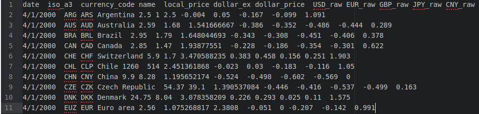
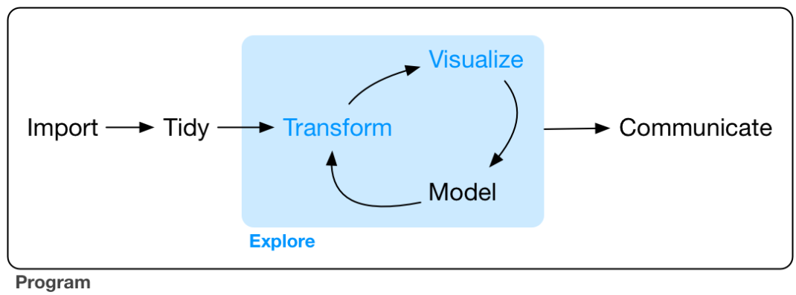

```{r setup, include=FALSE}
options(htmltools.dir.version = FALSE)
#require(plotly)
require(tidyverse)
#require(ggplot2)
```

# Today's outline

.middle[
1. Flow control
  1. if, else, ifelse
1. Loops
  1. for, while, repeat
  1. Advanced loops: the apply family
      1. lapply
      1. sapply
      1. mapply
1. Input/output
  1. Reading data
  1. Writing data
  ]

---

class: middle, inverse, center

# Flow control and loops

---


# Flow control

The simplest flow control is conditional execution `if` which takes a scalar and prompt a statements of if this value is `TRUE`.

```{r}
if(T==TRUE) print("This is tautological!")
```

```{r}
if(T) print("Same as above, but implicitly")
```

```{r}
if(FALSE==FALSE) print("Does it even worth mention it?")
```

```{r}
if(FALSE) print("This is not going to be printed")
```

```{r}
if(5<10) print("5 is less than 10")
```

Tip: For the sake of keeping good programming practices, it is recommented to employ curly brackets.
---

# Flow control

Conditional operations have little sense if there is no actions when the initial statement is not meet, is this case we are going to use `else`.

```{r}
x <- 8
if(x<=7){
  print("x is less equal than 7")
} else { # else MUST appear in the same line were the curly bracket closes
  print("x is more than 7")
}
```

Certainly, more complex conditional operations can be created adding `if` after the `else`. For instance:

```{r}
if(x<=7){
  print("x is less equal than 7")
} else if(x<10) {
  print("x is more than 7 but less than 10")
} else {
  print("x is more than 10")
}
```


---

# Flow control

The aforementioned statements only accept vectors of length zero, none the less, there are build-in functions that perform the same conditionals that can also be expanded to vectors. **Try it if you want**

The vectorized conditional function is `ifelse`, it is going to be truly useful is the future.

```{r}
x <- 1:10
ifelse(test = x<5, yes = "less than 5", no = "more equal than 5")
```

---

# Loops

Loops are used in programming to perform a specific task recursively. In this section we will learn how to create loops in R.

- There are 3 types of loops in R: `repeat`, `while` and `for`.
- Normally, loops are initialized with a separated variables.
- Inside a loop a control variable is specified

---

## `for` loop

- The programmer controls how many times a loop is executed
- Composed by an *iterator* and a *sequence vector*
- Given the iterator

```{r}
x <- letters[1:10]

for(i in 1:length(x)){
  print(x[i]=="g")
}

```

---

## `while` loop

.pl[
- `while` loops check first if a condition is met, if it does, executes, otherwise it does nothing.

```{r}
temperature <- 10
while(temperature < 18){
  print(paste0("If the temperature is "
               , temperature, " C°: Do not swim"))
  temperature=temperature+1
}
```

- The test expression `temperature < 18` evaluates according the current vector's value.
- `while` loops have to include a incremental statement, falling to do so will create a...
]


--
.center[Infinite loop!]
```{r, echo=FALSE, fig.align='center'}
knitr::include_graphics("https://media.giphy.com/media/EmMWgjxt6HqXC/giphy.gif")
```

---

## `repeat` loop

- Executes the same code until the user stops it.
- Repeating an action infinite number of times is a nonsense, therefore `repeat` is oftenly used jointly with `stop`or `break`

```{r, eval=FALSE}
repeat{
  message("This won't stop!!") # It is not evaluated
}
```

```{r}
x <- 1
repeat{
  print(x)
  x <- x+1
  if(x==5){
    break
  }
}
```

---

# Loops+

- As might think, loops in are not limited to `repeat` `for` or, `while`.
- Advance loop functions let you apply a function to lists, matrices or vectors...
- `rep` and `replicate` represent the basic idea of functions applied to vectors.

```{r}
set.seed(123)
rep(x = rnorm(1), 7)
replicate(n = 7, expr = rnorm(1))
```


---

# The `apply` family

- Part of base functions in R
- They use input lists and apply a function to each element.
- Family members differ in the type of object that stems from a execution.

.pl[
## `apply`
- Has 3 main arguments `X`, `MARGIN` and `FUN`
  - X is **matrix**
  - MARGIN refers to the orientation onto the functions has to be computed
    - 2 across **columns**
    - 1 across **rows**
```{r}
(mat <- matrix(1:25, nrow = 5))
```
]

.pr[
```{r}
apply(X = mat, MARGIN = 1, FUN = sum)
apply(X = mat, MARGIN = 2, FUN = sum)
```
]

---
## `lapply`

.pl[
- Permitted inputs: dataframes, lists or vectors.
- The outcome is a list (the *l* stands for something after all)

```{r}
set.seed(123)
list <- list(e1=rnorm(100, 5, 1)
             , e2=rnorm(100, 10, 1)
             , e3=rnorm(100, 15, 1)
             , e4=list(rnorm(100, 5, 1)*100))
lapply(X = list, FUN = mean)
```
]

.pr[
```{r}
lapply(X = list, FUN = function(x) mean(x[[1]]))
```

What's happening above?
]

---
.pl[
## `sapply`

- A wrapper of `lapply`
- Tries to simplify the outcome of `lapply` if the argument *simplify* is set at `TRUE` (the default value)

```{r}
sapply(list, function(x) mean(x[[1]]))
sapply(list, function(x) mean(x[[1]]), simplify = F)
```
]
.pr[
## `mapply`

- Multivariate apply
- Employ arguments and passes them into a function

```{r}
mapply(rnorm, n=1:5, mean=2, sd=1)
```
]

---
class: inverse, middle, center

# Input/output

---
# Read and write

A preliminary for data analysis is: having data. Some datasets are "pretty", that is, they come in tabular format, a little cleaning and we are done. On the other side there are unstructured data, typically text-heavy files that demand a huge amount of time in order to be used as an input.

Have you ever heard of the quote "big rocks first", well, we will do the opposite here. Let's start by showing how to import, create and format tabular datasets.

## Base reading functions

The easiest form of data to import in R are *spreadsheet-like* text files.

```{r}
ls("package:base", pattern = "read")
ls("package:utils", pattern = "read")
```


---
# Read and write

## `.txt` files

.pl[
Open a .txt files could easily become a Pandora's Box, you just never know if you are about to spread a misery in your work for days! 

```{r, echo=F}
knitr::include_graphics("https://media.giphy.com/media/5AVgmIw7iAzdK/giphy.gif")
```
]

.pr[
Problems:

- Missmatch decimal and thousand separators

| Locale                        | Format            |
|-------------------------------|-------------------|
| Canadian (English and French) | 4 294 967 295,000 |
| German                        | 4 294 967.295,000 |
| Italian                       | 4.294.967.295,000 |
| US-English                    | 4,294,967,295.00  |

- Ambigous column separators
  - Is it a Tab? Semicolon? Space? Comma?
]

---
# Import data
## `.txt` files

What we see:

```{r, echo=F, out.width="70%", fig.align='center'}

```

What R sees:

```{r}
readLines(con = "datasets/sample.txt", n = 11)
```

---
# Import data
## `.txt` files

```{r}
read.table(file = "datasets/sample.txt", sep = "\t")
```
```{r, error=TRUE}
read.delim(file = "datasets/sample.txt", sep = ".")
```

---
# Import data

.pl[
## `.csv` files

- CSV stands for Comma Separated Values
-  In practical terms .txt and .csv extensions aren't that different.
  - .csv extensions are composed by a delimiter and a enclosing (double quote to define a character), while .txt only have delimiter.
- `read.csv` formats character values as factors. This is inefficient since R has to map the values inside the vector a recognise how many different values exist within to form levels. Therefore, it is advisable to set `stringsAsFactors=FALSE`
]

.pr[
How to import a .csv to our environment?

```{r}
data <- read.csv("datasets/big-mac-full-index.csv"
                 , stringsAsFactors = F)
str(data)
```
]

---
.pl[
# Import data from other statistical software

- R is an open source language, which is nice since you are free to use it, create and implement your own functionalities. Nonetheless, is also create inconsistencies (remember how different package can use a function with the same name?).
- There are several packages that convert between different extensions, the most popular are:
  - `foreign`: Reading and writing data stored by some versions of 'Epi Info', 'Minitab', 'S', 'SAS', 'SPSS', 'Stata', 'Systat', 'Weka', and for reading and writing some 'dBase' files.
  - `haven`: Import and Export 'SPSS', 'Stata' and 'SAS' Files
  - The difference stems in that outcome type and the speed
]
--
.pr[
## Import from SPSS

```{r}
survey <- foreign::read.spss("datasets/survey.sav"
                             , to.data.frame = T)
dim(survey)
```

- Regularly SPSS files contain both a variable name and a description of such variable. When we read a SPSS file in R the labels disappear, and only the variables names are kept (labels can also be used, nonetheless they are most of the time big enough to not serve as a practical column name).
- R saves label (or description) as an attributes. Last session we learned that attributes can be extract with the function guess what? `attributes()`

```{r}
head(attributes(survey)$variable.labels)
```
]

---
## Import from other statistical systems

- `Haven` is extremely useful since it follows the *Tidy* philosophy that is taking place in R. (we will cover this in depth the next session)

.pl[
```{r}
(money <- foreign::read.dta("datasets/money.dta"))
```
]

.pr[
```{r}
(money <- haven::read_dta("datasets/money.dta"))
```

Do you see any difference?

```{r, echo=FALSE, out.width="25%"}
knitr::include_graphics("https://media.giphy.com/media/NS7gPxeumewkWDOIxi/giphy.gif")
```
]

---
# Exporting

- Exporting data in R is not different from Reading it
- Normally, exporting functions start with `write*`. For instance:

```{r}
haven::write_dta(data = head(survey), path = "datasets/survey.dta")
```

- Make sure that the output has the features you expected!

```{r}
export_obj <- survey[1:5, 1:3]
```


```{r}
write.csv(x = export_obj, file = "datasets/sample1.csv")
write.csv2(x = export_obj, file = "datasets/sample2.csv")
```

Are sample1 and sample2 equal? Let's see
```{r}
readLines(con = "datasets/sample1.csv", n = 2)
readLines(con = "datasets/sample2.csv", n = 2)
```

---
# Saving into R data format

.pl[
## RDS

- Saves and reload **one** object to a file

Write:
```{r, eval=FALSE}
saveRDS(object = object, file = "file.rds")
```
Read:
```{r, eval=F}
readRDS(file = "file.rds")
```
]
.pr[
## RData

- Saves one or more R objects

Write:
```{r, eval=FALSE}
save(list = list_objects, file = "file.RData")
```

Read:
```{r, eval=FALSE}
load(file = "file.RData")
```
]


---
class: inverse, middle, center

# Tidy Data and the Tidyverse

```{r, echo=F, out.width="25%"}
knitr::include_graphics("img/hex-tidyverse.png")
```

---
# Tidy data

- Wordly wisdom dictates that 80% of data analysis is spent in wrangling procedures.
- Data preparation is a recursive task
  - One does not simply keep with a final dataset, updating and transforming data is oftenly unavoidable.
  - Searching from anomalous data points
  - Sanity checks
  - Missing values imputation, etc.
- Tidy data provide a standard way to explore, organize and analyze data.

```{r, echo=FALSE, fig.showtext="fff", out.width="505", fig.cap="Data analysis workflow (source: Wickham & Garret, 2017)", fig.align='center'}

```

Related packages (not covered):

- `data.table`: Fast aggregation of large data, fast ordered joins, fast add/modify/delete of columns by group using no copies at all, list columns, friendly and fast character-separated-value read/write. Offers a natural and flexible syntax, for faster development.


---
# Tidy data

.pl[
- Most datasets are organized into columns and rows
- Columns are oftenly labeled, not in the case of rows (is more common in time series data)
- There are many ways to structure the same underlying data

&nbsp;

Structure #1
```{r, echo=FALSE}
(data <- data.frame(name=c("rebecca", "thomas", "janna")
                   , treatment_a=c(1, 3, 4)
                   , treatment_b=c(2, 6, 8)))
```

Structure #2

```{r, echo=FALSE}
data2 <- t(as.matrix(data[,-1]))
colnames(data2) <- data$name
data2
```
]

.pr[
### Principles

1. Each variable forms a column
1. Each observation forms a row
1. Each type of observational unit forms a table

&nbsp;

Tidy structure

```{r, echo=FALSE}
data %>% gather(key = "treatment", value = "result", -name)
```
]

---
# Tidy data

.pl[
- Tidy data is standard and makes it easy to extract variables
- Messy data regularly is described by:
  - Column headers are values, not variable names
  - Multiple variables are stored in one column.
  - Variables are stored in both rows and columns.
  - Multiple types of observational units are stored in the same table.
  - A single observational unit is stored in multiple tables.

- Solution?
  - Must messy datasets' problems can be solved by:
      - Melting
      - String splitting
      - Casting
]

.pr[
First things first...

```{r, eval=FALSE}
install.packages("tidyverse")
```

- Tidyverse is a set of packages that were designed to work together
- In this workshop we will follow this philosophy instead the base R functions
  - Why? Is more efficient and consistent
  - Old methods can be learnt "on-the-fly"
]

---
# Pipes

- In R one can apply succesive functions by enclosing between parentheses.
- Let's say we want to created a new variable inside the survey object (the one from the SPSS file), and get it's mean. This new variable is $age^2$

```{r}
x <- survey$age # New intermediary variable
age_2 <- x^2 # Apply the function
(mean_2 <- mean(age_2)) # Calculate the mean of squared age
```

Evidently, one could also use the following process
```{r}
(mean_2 <- mean((survey$age)^2))
```
 
Cleaner, isn't it? But, can you believe that there is a way to this more consistent and readable?

```r
# The basic pipe `%>%` works as:
y %>%
  f() %>%  = g(f(y))
  g()
```

---
# Pipes

So, if we want to get the mean value of the squared age:

```{r}
survey$age %>%
  .^2 %>%
  mean()
```

- `matrittr` allow us to create a more readable code
  - Structuring sequences of data operations left-to-right (as opposed to from the inside and out)
  - avoiding nested function calls,
  - minimizing the need for local variables and function definitions, and
  - making it easy to add steps anywhere in the sequence of operations.

Basic pipes

- x %>% f is equivalent to $f(x)$
- x %>% f(y) is equivalent to $f(x, y)$
- x %>% f %>% g %>% h is equivalent to $h(g(f(x)))$

Placeholder

- x %>% $f(y, .)$ is equivalent to $f(y, x)$
- x %>% $f(y, z = .)$ is equivalent to $f(y, z = x)$

---
# Dplyr

- My favorite package, by far!
- Establish a grammar syntax for data manipulation
- Main functions:
  - `mutate()` adds new variables that are functions of existing variables
  - `select()` picks variables based on their names.
  - `filter()` picks cases based on their values.
  - `summarise()` reduces multiple values down to a single summary.
  - `arrange()` changes the ordering of the rows.
  - `group_by` select and apply the functions above to specific value

#


