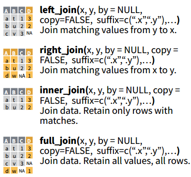
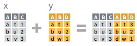
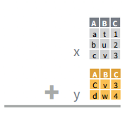

```{r setup, include=FALSE}
#require(plotly)
require(tidyverse)
require(broom)
#require(ggplot2)
```

class: inverse, middle, center

# Tidy Data and the Tidyverse

```{r, echo=F, out.width="25%"}
knitr::include_graphics("img/hex-tidyverse.png")
```

---
# `dplyr`: scoped variants

Until now we have seen the main function of `dplyr`. Each serves for specific tasks relating data wrangling. Nonetheless, each of them is accompanied with special variants called "scoped functions" that serve for even more explicit problems.

In this session we are going to work with the Global Financial Inclusion Database. According to the WB *"the world’s most comprehensive data set on how adults save, borrow, make payments, and manage risk."* The DB consist on 140 different countries with representative surveys of 150K adults age 15+ for the year 2017.

The data below is a 10% sample without replacement of the whole DB.

```{r, include=FALSE}
dic <- readr::read_csv("datasets/global_findex/dictionary.csv")
findex <- haven::read_spss("datasets/global_findex/global_findex.sav") %>% sample_frac(.1) %>%
    mutate_if(haven::is.labelled, .funs = ~haven::as_factor(.)) %>%
    dplyr::select(economy:fin2, fin7, fin8, fin14a, fin14b, fin19, fin26, fin28, fin32, fin37, mobileowner
                  , account_fin:receive_agriculture) %>%
    mutate(fin2_b=case_when(
        fin2=="yes"~1
        , TRUE~0)
        , age=as.numeric(age))

# findex_lab <- findex %>%
#     set_names(nm = c(dic$Name,"fin2_b"))  %>%
#     filter(Name %in% names(findex)) %>%
#     pull(Label)
#     )

write_rds(findex, path = "datasets/global_findex/sample_findex.rds")
#write_rds(findex_lab, path = "datasets/global_findex/sample_findex_labelled.rds")
```

```{r, warning=FALSE, message=FALSE}
findex <- readr::read_rds("datasets/global_findex/sample_findex.rds")

# There is a dictionary of the data as well.
dic <- readr::read_csv("datasets/global_findex/dictionary.csv")
```

---
## Scoped variants

- `*_all()`: affects every variable. Ex:
  - `mutate_all()`
  - `summarise_all()`
  - `filter_all()`
- `*_if()`: affects variables selected with a character vector or `vars()` Ex:
  - `mutate_if()`
  - `summarise_if()`-
  - `filter_if()`
- `*_at()`: affects variables selected with a predicate function (predicate are functions that return `TRUE` or `FALSE`) Ex:
  - `mutate_at()`
  - `summarise_at()`
  - `filter_at()`

---
## `_all()`

Example: `mutate_all()`
```{r}
findex %>%
    mutate_all(.funs = ~as.character(.))
```


---
## `_if()`

Example: `mutate_if()`

```{r}
findex %>%
    transmute_if(.predicate=is.numeric, .funs = list(log=~log(.)
                                                  , abs=~abs(.)))
```

---
## `_at()`

Example: `mutate_at()`

```{r}
findex %>%
    transmute_at(.vars = vars(contains("fin")), .funs = ~case_when(
        .=="no" ~ 0
        , .=="yes" ~ 1
    ))
```

---
## Merging data

.pl[
- Normally, one finds data distributed into several different files
- dplyr provides join functions to perform merging according to matching cells indetifiers
  <!-- - `left_join()` -->
  <!-- - `right_join()` -->
  <!-- - `inner_join()` -->
  <!-- - `full_join()` -->
  <!-- - `anti_join()` -->
  <!-- - `semi_join()` -->

```{r, echo=FALSE, out.width="50%", fig.align='center'}

```

  ]
  
.pr[
  
- Also it is possible to combine datasets when they share the same column names with `bind_cols()`

```{r, echo=FALSE, out.width="60%", fig.align='center'}

```

- Or rows with `bind_rows()`

```{r, echo=FALSE, out.width="40%", fig.align='center'}

```

]

---
## Merging data: example

.pl[
```{r}
(df1 <- tibble::tribble(
    ~col1, ~col2, ~col3,
      "a",     1,     3,
      "b",    NA,     5,
      "b",     5,     6
    ))

(df2 <- tibble::tribble(
           ~col1, ~col2, ~col4,
             "a",     1,  TRUE,
             "b",    NA, FALSE,
             "b",     6, FALSE,
             "c",    10, FALSE
           ))
```
]

.pr[
```{r}
(list_df <- list(e1=df1, e2=df1, e3=df2))
```

]

---
## Merging data: left and right

.pl[
```{r}
df1
df2
```
]

.pr[

```{r}
# left_join(): matches values from df2 to df1
df1 %>%
    left_join(df2)
```

```{r}
# right_join(): matches valyes from df1 to df2
df1 %>%
    right_join(df2)
```
]

---
## Merging data: inner and full

.pl[
```{r}
df1
df2
```
]

.pr[
```{r}
# inner_join(): retain only the rows with matches
df1 %>%
    inner_join(df2)
```
```{r}
# full_join(): retain all values, all rows
df1 %>%
    full_join(df2)
```
]

---
## Merging data: semi and anti

.pl[
```{r}
df1
df2
```
]

.pr[
```{r}
# semi_join(): returns rows of df1 that have match in df2
df1 %>%
    semi_join(df2)
```

```{r}
# anti_join(): return rows of df1 that do not have a match in df2
df1 %>%
    anti_join(df2) #<<
```
]

---
## Merging data: by row/column

.pl[
```{r}
df1
df2
```
]


.pr[
```{r}
# bind_rows: When row-binding, columns are matched by name, 
# and any missing columns will be filled with NA.
df1 %>%
    bind_rows(df2)
```

```{r}
# bind_cols: rows are matched by position, 
# so all data frames must have the same number of rows.
df1 %>%
    bind_cols(df1)
```
]

---
## Merging data: advanced stuff


- Join functions have a `by=` argument to match specific columns.
- If two matching columns have different names one can specify such details by:

```{r, eval=FALSE}
data1 %>%
    left_join(by = c("var1"="var2"))
```
--

.pl[
Notice the difference between:

```{r}
df1 %>%
    left_join(df2)
```
]

.pr[
and...
```{r}
df1 %>%
    left_join(df2, by="col1")
```
]

---
## Merging data: advanced stuff

.pl[
- What can we do if there are several separated datasets we want to:
    1. join?
    1. bind?
- According to the approach followed in the last slides it is necessary to call the join function per object, like:

```{r, eval=FALSE}
df1 %>%
    left_join(df2) %>%
    left_join(df3) %>% ...
```

- However, there is a powerful and intuitive way to execute this task with the reduce function, which is also embedded in the package `purrr`. Therefore the problem could be solved only by specifying the list of dataframes and then applying the joining function recursively. Example:]

.pr[

```{r}
list(df1, df1, df2) %>%
    reduce(.f = left_join, by="col1"
           , suffix=c("_iter1", "_iter2"))
```
]
---
# `tidyr`

- The main purpose of `tidyr` is to create tidy data
- There are 2 main functions for converting long to wide data and viceversa, plus other 2 useful for separating tasks.
    - `gather()`: takes multiple columns, and gathers them into key-value pairs: it makes “wide” data longer.
    - `spread()`: takes two columns (key & value), and spreads into multiple columns: it makes “long” data wider.
    - `separate()`: pull apart columns that represent multiple variables
    - `extract()`: turns each group into a new column
    
---
### `gather()`

.pl[
```{r}
(df1 <- df1 %>%
    mutate(obs=1:3))
```

```{r}
df1 %>%
    gather(key = "key", value = "data")
```
]

.pr[
```{r}
(df1_long <- df1 %>%
    gather(key = "key", value = "data"
           , -obs)#<<
 )
```
]

---
## `spread()`
.pl[
```{r}
(df1_long <- df1_long %>%
    mutate(new_var=paste0(data, "-", data)))
```
]

.pr[
```{r}
df1_long %>%
    spread(key = key, value = data)
```
]

---
## `separate()`

.pl[
```{r}
df1_long %>%
    separate(new_var, into = c("var1", "var2"), sep = "-")
```
]

.pr[
```{r}
sv <- tibble(id=1:3, q1=c("1", "1,2", "1,3,4"))
sv %>%
    separate_rows(q1)
```
]

---
# `purrr`

.pl[
- Toolkit by providing a complete and consistent set of tools for working with functions and vectors.
- Allow you to replace many for loops with code that is both more succinct and easier to read.
- `purrr` has docenzs of functions, some could be overly complex. However, must of the time we will use the most basic function called `map()`
    - The `map_*()` functions transform their input by applying a function to each element and returning a vector the same length as the input.
    - `map()` is a powered `apply()`!

```{r}
lapply(X = letters[1:3], FUN = function(x) return(x))
```
]

.pr[
```{r}
map(.x = letters[1:3], .f = function(x) return(x)) # explicit functions
map(.x = letters[1:3], .f = ~return(.)) # implicit functions
```
]
---
# `purrr`: unleashing the true power

```{r}
(findex_model <- findex %>%
     group_by(economy, regionwb))
```

---
# `purrr`: unleashing the true power

```{r}
(findex_model <- findex %>%
     group_by(economy, regionwb) %>% 
     nest() # take every peace of data associated with the group
 )
```

---
# `purrr`: unleashing the true power

```{r, warning=FALSE, message=FALSE}
(findex_model <- findex %>%
    group_nest(economy, regionwb) %>% # Notice that there is a function that does the =
    mutate(model=map(data # loop over each element of the column data
                     , ~glm(fin2_b~pop_adult+female+age+educ # specification
                            , data = . # the dot is interpreted as every value of data
                            , family = binomial() # link function
                            )
                     )
           )
 )
```

---
# `purrr`: unleashing the true power

```{r, warning=FALSE, message=FALSE}
(findex_model <- findex %>%
    group_nest(economy, regionwb) %>%
    mutate(model=map(data
                     , ~glm(fin2_b~female+age+educ
                            , data = .
                            , family = binomial()
                            )
                     )
           , coef=map(model, tidy) # coefficients as tibble
           , stats=map(model, glance) # summary statistics
           , fitted=map(model, augment) # adds info on each observation
           ) 
 )
```

---
# `purrr`: unleashing the true power

```{r}
findex_model$coef[[1]]
```


---
# `purrr`: unleashing the true power

Let's extract the log odds gender==female
```{r}
(findex_model %>%
    mutate(female_coef=map(coef, ~.x %>%
                            dplyr::filter(term=="femaleFemale")
                           )
           )
 )
```


---
# `purrr`: unleashing the true power

Why not calculing confidence intervals? and extracting the relevant variables
```{r}
(findex_model %>%
    mutate(female_coef=map(coef, ~.x %>%
                            dplyr::filter(term=="femaleFemale") %>%
                            mutate(min_int=estimate-1.96*std.error
                                   , max_int=estimate+1.96*std.error) %>% 
                            dplyr::select(estimate, p.value, contains("int")
                                          )
                           )
           )
 )
```

---
# `purrr`: unleashing the true power

Let's get rid of the columns that we are not interested

```{r}
(findex_model %>%
    mutate(female_coef=map(coef, ~.x %>%
                            dplyr::filter(term=="femaleFemale") %>%
                            mutate(min_int=estimate-1.96*std.error
                                   , max_int=estimate+1.96*std.error) %>% 
                            dplyr::select(estimate, p.value, contains("int")
                                          )
                           )
           ) %>% 
     dplyr::select(economy, regionwb, female_coef)
 )
```

---
# `purrr`: unleashing the true power

What's inside female_coef?

```{r}
(findex_model <- findex_model %>%
    mutate(female_coef=map(coef, ~.x %>%
                            dplyr::filter(term=="femaleFemale") %>%
                            mutate(min_int=estimate-1.96*std.error
                                   , max_int=estimate+1.96*std.error) %>% 
                            dplyr::select(estimate, p.value, contains("int")
                                          )
                           )
           ) %>% 
     dplyr::select(economy, regionwb, female_coef) %>% 
     unnest(female_coef)
 )
```


---
# `purrr`: unleashing the true power

Little exploration maybe?

```{r}
findex_model %>% summary()
```

---
# `purrr`: unleashing the true power

The natural question is "why", but for the sake of the exercise we are going to truncate the data and keep the record that lie between the 10% and 90% percentile of the lower confidence interval
```{r}
(findex_model_coef <- findex_model %>%
    filter_at(.vars = vars(min_int)
              , .vars_predicate = any_vars(between(., quantile(., 0.1)
                                                   , quantile(., 0.9)
                                                   )
                                           )
              ) )
```

---
# `purrr`: unleashing the true power

.pl[
```{r}
g0 <- findex_model_coef %>% 
    qplot(min_int, geom = "density", data = ., ylab = "density")+
    scale_x_continuous(limits = c(-5, 0))
```
]

.pr[
```{r, echo=FALSE}
g0
```
]

---
# `purrr`: unleashing the true power

.pl[

```{r}
g1 <- findex_model_coef %>%
    filter(grepl(regionwb, pattern = "High")) %>%
    ggplot() +
    geom_point(aes(economy, estimate, col=economy))+
    geom_linerange(aes(ymin=min_int, ymax=max_int, x=economy))+
    geom_hline(yintercept = 0, linetype="dotted", col="red")+
    coord_flip()+
    facet_wrap(~regionwb)
```
]

.pr[
```{r, echo=FALSE}
g1
```
]