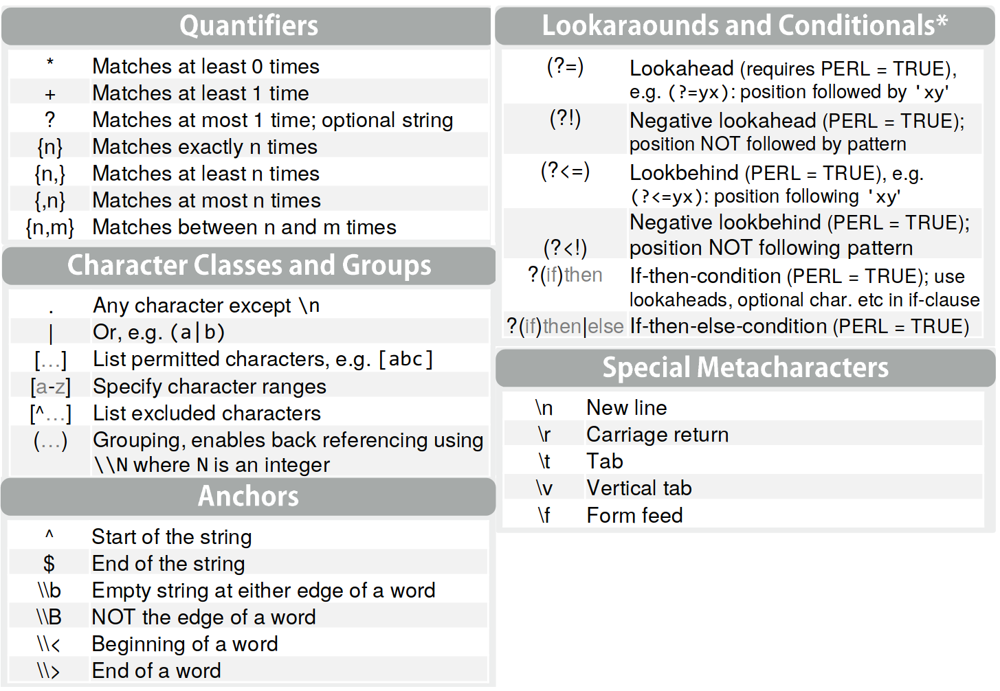

```{r setup, include=FALSE}
knitr::opts_chunk$set(echo = TRUE, fig.align = "center")
require(tidyverse)
require(broom)
require(knitr)
require(rvest)
#library(tidylog)
library(tidytext)
require(tsibble)
```


# Outline

- Sentiment analysis
    - Twitter API
    - Text files
    - Regular expressions
- Graphs with `ggplot2`

---
# Sentiment analysis

.pl[
1. Information gathering involves finding what other people think
1. Growing availability of opinion rich content in the Internet opened new possibilities
1. Sentiment analysis, (also called opinion mining)
    1. Field of study that analyzes: people’s opinions, sentiments, appraisals, attitudes, and emotions toward entities and their attributes expressed in written text.
    1. Entities could be: products, services, organizations, individuals, events, issues, or topics
    1. Computational treatment of the opinion, sentiment, and subjectivity
]

.pr[
```{r, echo=FALSE}
include_graphics("https://cdn.pixabay.com/photo/2017/11/26/15/16/smiley-2979107_960_720.jpg")
```
]

---
# Sentiment analysis

.pl[
1. It has been an active research field of natural language processing (NLP).
    1. Data mining
    1. Web mining
1. In acamedia is strongly related to **reputation mechanisms**
    1. Online reputation mechanisms builds **trust** inside marketplaces.
    1. Reputation mechanism promote cooperation and reduce asymmetric information.
    1. Lemons? Anybody?
]

.pr[
```{r, echo=FALSE, fig.cap="Source: https://medium.com/@avtarsehra/icos-and-economics-of-lemon-markets-96638e86b3b2"}
include_graphics("https://cdn-images-1.medium.com/max/1200/1*NvWwH4yrQ-qK8X6yzLBOig.png")
```
]

---
# Sentiment analysis

1. Creating systems that can process subjective information effectively requires overcoming a number of novel challenges.

--

1. Complex structure of the languange
  1. Contradictory: Some phrases might express contradictory polarity conditional on the context:
      1. *This camera sucks* vs *this vaccum cleaner really sucks*
  1. Sentences can express no sentiment at all
      1. *Can you tell me which Sony camera is good?*
      1. *Does anyone know how to repair this terrible printer?* (ever more complex)
  1. Sarcasm: there is a great amoun of people who do not get it, imagine a machine!
      1. Not common in product reviews, but there's plenty of them in politics.
  1. Implicit sentiment
      1. *This washer uses a lot of water* (bad)

---
# Sentiment analysis

1. Sentiment words can be divided into:
    1. base type: as expressed before
    1. comparative type: better, worse, best, worst, etc.

--

1. There three main approaches compile sentiment words:
    1. Manual: time consuming
    1. Dictionary-based: Process of the algorithm: seeds' sentiment words, search for synonyms/antonyms, propagate polarity and ends with manual cleaning. There are more complex algorithms as well.
    1. Corpus-based: given a seed of list of known sentiment words, discover other sentiment words and their orientations from a domain corpus. Adapt the new sentiment lexicon using the domain corpus. 

--

1. Sentiment analysis is a whole are of NLP, therefore there is vas amount of details and approaches, in this session we will focus on dictionary lexicon-based method for sentiment analysis.


---
# Sentiment analysis [in practice]

1. My must include in our technical toolbox **regular expressions (REGEX)**
1. Then again, is a whole universe of rules.
    1. There will be always one easier way to solve one problem. Practice matters a lot.
1. REGEX reference: https://www.regular-expressions.info/refcapture.html
1. REGEX gymnasium: https://regex101.com/
1. REGEX in R cheatsheet: https://www.rstudio.com/wp-content/uploads/2016/09/RegExCheatsheet.pdf
1. Main difference: R uses two escaping backslashes `\\`
1. Is an iterative process. The cleaning process demands a lot of time.


---
# Sentiment analysis [in practice]

```{r, echo=FALSE, out.width="60%"}

```

---
# Sentiment analysis [in practice]


.pl[
## Packages
```{r, message=FALSE}
library("twitteR")
library("tidytext")
library(qdap)
library(tm)
library(epubr)
```
]


.pr[
## Relevant functions
```{r eval=FALSE}
tm::removePunctuation() 
tm::removeNumbers()
tm::stripWhitespace()
tm::removeWords()
tm::stopwords()
tm::stemDocument() # reduce words to unify documents eg 
# computers, computation -> comput -> computer
tm::TermDocumentMatrix()
tm::DocumentTermMatrix()
tm::stemCompletion() # complete the word taking as an input a dictionary
qdap::bracketX(): # "It's (so) cool" -> "It's cool"
qdap::replace_number(): # "2" -> "two"
qdap::replace_abbreviation(): # "Sr" -> "Senior"
qdap::replace_contraction(): # "shouldn't" -> "should not"
qdap::replace_symbol() # "$" -> "dollar"
```

]

---
# Sentiment analysis [Twitter API]

.pl[
As humans, what are some things that we want that technology might help us to get?
1. We want to be heard.
1. We want to satisfy our curiosity.
1. We want it easy.
1. We want it now.

]

.pr[
```{r, echo=FALSE}
include_graphics("https://images.unsplash.com/photo-1543185377-aa2f876d1760?ixlib=rb-1.2.1&ixid=eyJhcHBfaWQiOjEyMDd9&auto=format&fit=crop&w=1350&q=80")
```

]

.footnote[
How to create a Twitter API: https://towardsdatascience.com/access-data-from-twitter-api-using-r-and-or-python-b8ac342d3efe
]

---
# Sentiment analysis [Twitter API and Brexit]


```{r, include=FALSE, eval=FALSE}

```


```{r, eval=FALSE, include=T}
tw = searchTwitter(searchString = "#Brexit OR Brexit", n = 500, lang = "en") %>% 
    twListToDF() %>% # Converts raw tweets to dataframe
    as_tibble()
#write_rds(tw, path = "datasets/twitter.rds")
```

```{r}
tw <- read_rds(path = "datasets/twitter.rds")
tw$text %>% 
  head(10)
```

---
# Sentiment analysis [Case: One hundred years of solitude]

```{r, out.height="460", echo=FALSE, fig.cap="Cien años de soledad - Gabriel García Marquez (eng. version)"}
include_graphics("https://images-na.ssl-images-amazon.com/images/I/91ruYlNHCfL.jpg")
```

---
# Sentiment analysis
## Case: One hundred years of solitude


```{r, eval=T}
#cas <- epub("datasets/garcia_one_hundred.epub")
#write_rds(cas, path = "datasets/cas.rds")
(cas <- read_rds("datasets/cas.rds") %>% 
  dplyr::select(title:date, data))

cas$data[[1]] %>%
  head(5)

# Work from the text
cas <- cas$data[[1]]
```

---
# Sentiment analysis: lexicons and polarity

.pl[
```{r}
# afinn
get_sentiments(lexicon = "afinn") %>% 
  summary()

# bing
get_sentiments(lexicon = "bing") %>% 
  distinct(sentiment)

```
]

.pr[
1. AFINN is a list of English words rated for valence with an integer
between minus five (negative) and plus five (positive). The words have
been manually labeled by Finn Årup Nielsen in 2009-2011. The file
is tab-separated. [Source](http://www2.imm.dtu.dk/pubdb/views/publication_details.php?id=6010)
1. Bing proposed the Feature-Based Opinion Mining model, which is now also called Aspect-Based Opinion Mining [Source](https://www.cs.uic.edu/~liub/FBS/sentiment-analysis.html#lexicon)
]
 
---
# Sentiment analysis: lexicons and polarity

.pl[
```{r}
# nrc
get_sentiments("nrc") %>% 
  distinct(sentiment) %>% 
  pull(sentiment)

# loughran
get_sentiments("loughran") %>% 
  distinct(sentiment) %>% 
  pull(sentiment)
```
]

.pr[
1. The NRC Emotion Lexicon is a list of English words and their associations with eight basic emotions (anger, fear, anticipation, trust, surprise, sadness, joy, and disgust) and two sentiments (negative and positive). The annotations were manually done by crowdsourcing. [Source](https://saifmohammad.com/WebPages/NRC-Emotion-Lexicon.htm)
1. Loughran contains tools useful for textual analysis in financial applications and data from some of the textual-related publications. [Source](https://sraf.nd.edu/textual-analysis/resources/)
]

---
# Sentiment analysis: lexicons and polarity

1. Polarity is calculated with according to the following variables
    1. Polarized term: negative or positive
    1. Neutral term: no emotion
    1. Negator: inverted polarized eg "not good"
    1. Valence shifters: words that affect the emotional context
        1. Amplifiers: increase emotional context (eg very good)
        1. De-amplifiers: decrease emotional context (eg not bad)

```{r}
string <- c("The view from east side of the bridge is very good")

(polarity <- qdap::polarity(string))
```

$$
\frac{term + amplifier}{\sqrt{n}} \\
\frac{1 + 0.8}{\sqrt{11}}=0.54
$$


---
# Sentiment analysis [Twitter API and Brexit]


```{r, eval=T}
## First steps
tw1 <- tw %>% 
    dplyr::select(text, id) %>% 
    mutate(text=str_squish(text)
           , link=str_extract_all(text, pattern = "(?<=(https:\\/\\/)).+", simplify = T) %>% 
               as.vector()
           , mention=str_extract_all(text, pattern = "(?<=(@)).+(?=: )", simplify = T) %>% 
               as.vector()
           , rt=ifelse(str_detect(string = text, pattern = "RT(?= @)"), yes = T, F)
           , hashtags=str_extract_all(text, "#\\S+") %>% 
               map(.f = ~paste0(., collapse = ";")) %>% 
               unlist()
           , text_clean=str_remove_all(text, pattern = "…|(#\\S+ )|(@\\S+ )|(htt\\S+)|(RT )") %>% 
               str_replace_all(pattern = "’", replacement = "'") %>%
               str_remove_all(pattern = "![:alpha:]") %>% 
               str_to_lower() %>% 
               qdap::replace_abbreviation() %>% 
               qdap::replace_contraction() %>% 
               tm::removePunctuation() %>% 
               tm::removeWords(words = c(stop_words$word, stopwords())) %>% 
               str_squish() %>% str_to_lower()
               ) %>% 
    mutate(word=map(text_clean, ~str_extract_all(string = .x
                                                 , pattern = "[[:alpha:]]+", simplify = T) %>% 
                        as.vector() %>% 
                        str_split(pattern = " ", simplify = T)
                    )
           , text_clean=str_to_lower(string = text_clean)) %>%
    unnest(word)

```
 
---
# Sentiment analysis [Twitter API and Brexit] 
 
.pl[
```{r g1, eval=F}
tw2 <- list(tw1, get_sentiments("afinn")
     , get_sentiments("bing")
     , get_sentiments("nrc")
     , get_sentiments("loughran")) %>% 
  reduce(left_join, by="word") %>%
  group_by(id) %>% 
  filter(!duplicated(word)) %>% 
  rename(afinn=score, bing=sentiment.x, nrc=sentiment.y, loughran=sentiment)

tw2 %>% 
  group_by(word) %>% 
  tally() %>% 
  arrange(desc(n)) %>% 
  top_n(n = 20, wt = n) %>% 
  ggplot(aes(x = reorder(word, n), y = n))+
  geom_col()+
  coord_flip()
```
 ]
 
.pr[
```{r g1-label-out, ref.label="g1", eval=T, echo=FALSE}
```
]

---
# Sentiment analysis [Twitter API and Brexit] 

.pl[
## AFINN

```{r g_afinn, eval=FALSE}
tw2 %>% 
  filter(!is.na(afinn)) %>% 
  group_by(rt) %>% 
  summarise(mean=mean(afinn)) %>% 
  ggplot(aes(rt, mean))+
  geom_col()+
  labs(x="Is it retweeted?")
```
]

.pr[
```{r ref.label="g_afinn", echo=F, fig.retina=2}

```
]


---
# Sentiment analysis [Twitter API and Brexit] 


.pl[
## BING

```{r g_bing, eval=FALSE}
tw2 %>% 
  filter(!is.na(bing)) %>% 
  group_by(bing) %>% 
  tally() %>% 
  ggplot(aes(bing, n))+
  geom_col()
```

]

.pr[
```{r ref.label="g_bing", echo=FALSE,fig.retina=2}

```

]

---
# Sentiment analysis [Twitter API and Brexit] 

.pl[
## NRC
```{r g_nrc, eval=FALSE}
tw2 %>% 
  filter(!is.na(nrc)) %>% 
  group_by(rt, nrc) %>% 
  tally() %>% 
  mutate(sum=sum(n), n=n/sum) %>% 
  replace_na(replace = list(sadness=0)) %>% 
  ggplot(aes(reorder(nrc, n), n, fill=rt))+
  geom_col(position = "dodge")+
  coord_flip()
```
]

.pr[
```{r ref.label="g_nrc", echo=FALSE, fig.retina=2}

```

]

---
# Sentiment analysis [Twitter API and Brexit] 

.pl[
## Loughran

```{r g_lou, eval=FALSE}
tw2 %>% 
  filter(!is.na(loughran)) %>% 
  group_by(rt, loughran) %>% 
  tally() %>% 
  mutate(sum=sum(n), n=n/sum) %>% 
  replace_na(replace = list(sadness=0)) %>% 
  ggplot(aes(reorder(loughran, n), n, fill=rt))+
  geom_col(position = "dodge")+
  coord_flip()
```
]

.pr[
```{r ref.label="g_lou", echo=FALSE, fig.retina=2}

```

]

---
# Sentiment analysis [CAS]


```{r}
cas1 <- cas %>% 
  slice(3:n()) %>%
  mutate(text=str_to_lower(text) %>% 
           tm::removePunctuation() %>% 
           str_remove_all(pattern = "\\n") %>% 
           tm::removeWords(words = stop_words$word) %>% 
           str_squish()) %>% 
    unnest_tokens(output = "word", input = "text") %>% 
    left_join(get_sentiments("afinn")) %>%
    left_join(get_sentiments("nrc")) %>% 
    #replace_na(replace = list(score=0)) %>% 
    #group_by(section) %>% 
    mutate(n=1:n(), sum=sum(score)
           , mean=mean(score, na.rm = T))
```

---
# Sentiment analysis [CAS]

```{r eval=T, warning=FALSE, message=FALSE, echo=T, out.width="60%", fig.height=4, fig.width=7, fig.retina=2}
cas1 %>% 
    as_tsibble(index = n) %>% 
    mutate(pol2=tsibble::slide_dbl(score, ~sum(.x, na.rm = T), .size = 100, .step = 25)) %>% 
    ggplot(aes(n, pol2, col=sentiment))+
    geom_point(aes(col=sentiment))+
    geom_smooth(se = F)
```


---

# References

.middle[
- Danneman, N., & Heimann, R. (2014). Social media mining with R. Packt Publishing Ltd.
- Munzert, S., Rubba, C., Meißner, P., & Nyhuis, D. (2014). Automated data collection with R: A practical guide to web scraping and text mining. 
- John Wiley & Sons. Russell, M. A. (2013). Mining the Social Web: Data Mining Facebook, Twitter, LinkedIn, Google+, GitHub, and More. " O'Reilly Media, Inc.".
]

