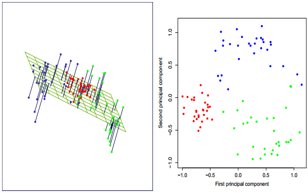

```{r, echo=FALSE, warning=FALSE, message=FALSE}
knitr::opts_chunk$set(fig.align = "center", fig.retina = 4, out.width = "100%")
library(tidyverse)
library(knitr)
library(magrittr)
library(factoextra)
library(cluster)
library(gridExtra)
library(factoextra)
```

```{r, echo=FALSE}
stdF <- function(x){
    (x-mean(x, na.rm = T))/sd(x, na.rm = T)
}

normF <- function(x){
    (x-min(x, na.rm = T))/(max(x, na.rm = T)-min(x, na.rm = T))
}

robF <- function(x){
    (x-quantile(x, na.rm = T, probs = 0.25))/(quantile(x, na.rm = T, probs = 0.25)-quantile(x, na.rm = T, probs = .75))
}
```


# Outline

1. Unsupervised learning
    1. Types
    1. Challenges
1. Clustering
    1. (Dis)similiarity measures
        1. Quantitative and non-quantitative
    1. Algorithms
1. Dimensionality reduction


---
# End-to-end machine learning project


.middle[
1- Look at the big picture.  
2- Get the data.  
3- Discover and visualize the data to gain insights.  
4- Prepare the data for Machine Learning algorithms.
.speccolor1[5- Select a model and train it.  
6- Fine-tune your model.  
7- Present your solution.  
8- Launch, monitor, and maintain your system]]

---
# Unsupervised learning

### Definition

1. Subsumes all kinds of machine learning where there is **no known output**
1. "Learning without a teacher"

--

### Types

1. Unsupervised transformations (UT): algorithms that create new representation of high dimensional data, which output is potentially easier for other algorithms as well as human to understand the underlying structure.
    1. Dimensionality reduction is the most common application of UT. It summarises the data by creating a smaller feature space that contains as much as possible the variance of the original representation.
    1. Clustering algorithms: partition of data into different groups according to a similarity rule.
    
--

### Challenges

1. Evaluate if the algorithm is learning something salient
1. With unlabeled data is hard to tell if the we have done right.
    1. In psychological studies is common to construct factors from a set of features.
1. Is considered as "pre-processing" the data which is going to be used for supervised learning models.
1. Unsupervised learning algorithms are **highly sensitive to scales**.


---
# Unsupervised learning: Clustering (data segmentation)

### Definition

1. The process of grouping similar objects together.
1. Grouping/segmenting a collection of objects into subsets or "clusters", such that those within each cluster are more closely related to one another than objects assigned to different clusters.

--

### Inputs

1. Similarity-based clustering $(N \times N)$
    1. Instrument are typically dissimilarity or distance matrices.
1. Feature-based clustering $(N \times X_p)$

--

### Outputs

1. Flat clustering: partition into disjoint sets
    1. It is necessary to provide ex-ante the number of sets
1. Hierarchical clustering: nested tree sets
    1. It is not required to specify the number of sets
    
---
# Unsupervised learning: Clustering (data segmentation)
## Transformations

.pl[
1. As stated, clustering algorithms are sensitive to scales. It is a common practice to transforma the features.
    1. Normalize $x_i \in (0,1)$: $\frac{x_i-min(x_i)}{max(x_i)-min(x_i)}$
    1. Standardize $x_i \sim (0,1)$: $\frac{x_i-E(x_i)}{\sigma_{x_i}}$
    1. Robust scaler: $\frac{x_i-Q_1(x_i)}{Q_3(x_i)-Q_1(x_i)}$
```{r, eval=FALSE}
x1=1*rep(1, 100)+rnorm(100, sd = 2)
x2=4*rep(1, 100)+rnorm(100)
```
   
```{r}
stdF <- function(x){
    (x-mean(x, na.rm = T))/sd(x, na.rm = T)
}

normF <- function(x){
    (x-min(x, na.rm = T))/(max(x, na.rm = T)-min(x, na.rm = T))
}
```
 
]

.pr[
```{r, echo=FALSE, out.width="100%", fig.height=5, fig.retina=2}
tibble::tibble(x1=1*rep(1, 100)+rnorm(100, sd = 2)
               ,x2=4*rep(1, 100)+rnorm(100)
               , index=(1:100)) %>% 
    mutate_at(vars(x1, x2), .funs = list(std=~stdF(.)
                                         , norm=~normF(.)
                                         , rob=~robF(.))) %>%
    pivot_longer(cols = -index) %>% 
    mutate(type=case_when(
        str_detect(name, pattern = "std")~"std"
        , str_detect(name, pattern = "norm")~"norm"
        , str_detect(name, pattern = "rob")~"robust"
        , TRUE~"original"
    )
    , var=str_sub(name, 1, 2)
    ) %>% 
    ggplot()+
    geom_boxplot(aes(var, value, fill=type))+
    theme(legend.position = "bottom")
```
]


---
# Unsupervised learning: Clustering (data segmentation)
## Measuring (dis)similarity

1. A clustering method attempts to group the objects based on the definition of similarity supplied to it.
1. Data is defined in terms of proximity between a pair of objects. Proximity can be measure either by affinity (similarities) or lack of it (dissimilarities).
    1. $D$ of size $N \times N$, where $N$ is the number of objects.
    1. Matrix $D$ is used as an input for the algorithm
    1. Algorithms assumes that the matrix $D$ is simmetric
1. A dissimilarity matrix $D$ is a matrix where $d_{i,i}=0$ and $d_{i,j}\ge0$, that is, it measures the distance between elements $i$ and $j$.

---
# Unsupervised learning: Clustering (data segmentation)
## Measuring (dis)similarity based on attributes

1. Most often we have measurements $x_{ij}$ for $i = 1, 2, . . . , N$, on variables $j = 1, 2, . . . , p$ (also called attributes)
1. Step 1: construct pairwise dissimilarities between the observations and used as input.
1. Step 2: We define a dissimilarity $d_j(x_{ij}, x_{i'j})$ between values of the jth attribute.
1. Step 3: Define the measure according to the type of attribute (feature)

### Quantitative

| Measure | Formula |
|-------------|-----------------------------------------------------------------------------------------------------------------------------------------|
| Absolute | $d(x_i,x_i')=abs(x_i-x_i')$ |
| Squared | $d(x_i,x_i')=(x_i-x_i')^2$ |
| Correlation | $\frac{\sum_{i=1}^{n} (x_i - \overline{x})(y_i - \overline{y})} {\sqrt{\sum_{i=1}^{n} (x_i - \overline{x})^2(y_i - \overline{y})^2}}$ |

---
# Unsupervised learning: Clustering (data segmentation)
## Measuring (dis)similarity based on attributes

### Categorical

1. Ordinal: Ordered set of elements eg likert scales. Error measures for ordinal features are generally defined by replacing their $M$ original values following:

$$
\frac{i-1/2}{M}, \ i=1,\dots,M
$$

1. Categorical: With unordered categorical (nomimal) we must assess the degree-of-difference between pairs of values by creating $M \times M$ matrix of distinct elements. Distance is given by $L_{rr'}=1$ if the elements match.

One can create a correlation of categorical variables with **tetrachoric** (binary) and **polychoric** (ordinal) correlations.
[Nice description](http://www.john-uebersax.com/stat/tetra.htm)

In the [appendix](#appendix) I have included more distance measures.


---
# Unsupervised learning: Clustering (data segmentation)
## Algorithms
.middle2[
1. Combinatorial: work directly on the observed data with no direct reference to an underlying probability model
    1. Most popular
    1. Hard to assess the quality of grouping output
1. Mixture modeling: data is an i.i.d sample from some population described by a probability density function.
1. Mode seekers (“bump hunters”) take a nonparametric perspective, attempting to directly estimate distinct modes of the probability density function.
]

---
# Unsupervised learning: Clustering (data segmentation)

## Combinatorial

1. Each observation is uniquely labeled by an integer $i \in \{1, · · ·, N\}$.
1. Prespecified number of clusters $K < N$ is postulated, and each one is labeled by an integer $k \in \{1, . . . , K\}$
1. Each observation is assigned to one and only one cluster.
1. Heuristic procedure
1. Popular algorithms 
    1. K-means clustering
    1. Hierarchical clustering

---
# Unsupervised learning: Clustering (data segmentation)

.pl[
## K-means
```{r, echo=FALSE, out.width="100%"}
include_graphics("img/session_6/k_means.png")
```
]

.pr[
```{r, echo=FALSE, out.width="70%"}
include_graphics("img/session_6/k_means2.png")
```
]

---
# Unsupervised learning: Clustering (data segmentation)
.pl[
## Hierarchical clustering (HC)

1. K-means demand to establish the number of clusters beforehand. In contrast, hierarchical clustering methods do no require such specifications.
1. With HC the user have to specify a measure of dissimilarity between (disjoint) groups of observations, based on the pairwise dissimilarities among the observations in the two groups.
1. Produces hierarchical reprentation of the data
]

.pr[
```{r, echo=FALSE}
include_graphics("img/session_6/hier1.png")
```
]

---
# Unsupervised learning: Clustering (data segmentation)

.pl[
## Hierarchical clustering (HC)
1. Agglomerative (bottom-up): it starts by merging two set of clusters, then repeat the process in the next level.
    1. Step 1: Every observation represents a cluster
    1. Step 2: Cluster merge into a single cluster in the next level
    1. The dissimilarity at each level could be:
        1. Single linkage (SL) or nearest-neighbor
        1. Complete linkage (CL)
        1. Average linkage (AL)
        1. Centroid linkage (CeL)
        1. Ward’s minimum variance method (ward)
]

.pr[
```{r, echo=FALSE, out.width="100%"}
include_graphics("img/session_6/hier2.png")
include_graphics("img/session_6/hier3.png")
```
]

---
# K-means clustering: segmentating the countries according to WDI

```{r, eval=FALSE}
wdi <- WDI::WDI(country = "all", indicator = c("unemp"="SL.UEM.TOTL.ZS"
                                                , "secon_enrol"="SE.SEC.ENRR"
                                                , "gov_exp_ed"="SE.XPD.TOTL.GD.ZS"
                                                , "fert_rate"="SP.DYN.TFRT.IN"
                                                , "life_exp"="SP.DYN.LE00.MA.IN"
                                                , "gni_pc"="NY.GNP.PCAP.CD")
                 , start = 2014
                 , end = 2018) %>% 
    as_tibble()
```

```{r, echo=FALSE}
(wdi <- readr::read_rds("datasets/wdi.rds"))
```

---
# K-means clustering: segmentating the countries according to WDI

.pl[
```{r step1, eval=FALSE}
wdi %>% 
  group_by(country) %>% 
  summarise_at(.vars = vars(unemp:gni_pc)
               , .funs = ~mean(., na.rm = T)
               ) %>% 
  naniar::vis_miss()
```
]

.pr[
```{r ref.label="step1", echo=FALSE, fig.retina=3}

```
]


---
# K-means clustering: segmentating the countries according to WDI

```{r step2, eval=FALSE}
(wdi_case <- wdi %>% 
  group_by(country) %>% 
  summarise_at(.vars = vars(unemp:gni_pc)
               , .funs = ~mean(., na.rm = T)
               ) %>% 
  filter(complete.cases(.)) %>% # filter and keep complete cases only
  mutate(country=str_to_lower(country)) %>% 
  filter(!grepl(country, pattern = "asia|euro|america|demographic|countries|income|ida|oecd|small|africa|world")
         )
 )
```

```{r ref.label="step2", echo=FALSE}

```

---
# Necessary packages for this session

```{r, eval=FALSE}
library(tidyverse)
library(knitr)
library(magrittr)
library(factoextra)
library(cluster)
library(gridExtra)
```


---
# K-means clustering: segmentating the countries according to WDI

.pl[
## Transformations
```{r g1, eval=FALSE}
(wdi_case %<>% 
  mutate_at(.vars = vars(-country), .funs = ~stdF(.))) %>% 
  pivot_longer(cols = -country) %>% 
  ggplot(aes(fill=name, value))+
  geom_density(alpha=.5, col="white")
```

Tip: The build-in function `scale(x)` does the same as the user-defined function `stdF(x)`
]

.pr[
```{r ref.label="g1", echo=FALSE, fig.retina=3}

```
]

---
# K-means clustering: segmentating the countries according to WDI

.pl[
## Distance

```{r g2, eval=FALSE}
(wdi_case_df <- wdi_case %>%
    tibble::column_to_rownames("country")) %>% 
  get_dist(method = "euclidean") %>% 
  fviz_dist()
```

Tip: The package `factoextra`is a good tool to visualize clusters in R.

]

.pr[
```{r ref.label="g2", echo=FALSE, fig.retina=4}

```
]

---
# K-means clustering: segmentating the countries according to WDI

.pl[
```{r}
set.seed(123)
wdi1 <- wdi_case %>%
    sample_n(50) %>% 
    tibble::column_to_rownames("country")  # kmeans does not work well with tibbles (for now)

(kmeans <- c(2:10) %>% 
    enframe(name = "name", value = "centers") %>% 
    dplyr::select(-name) %>% 
    mutate(k_means=map(centers, ~kmeans(wdi1, centers = ., nstart=25)
                       )
           )
  )
```
]

.pr[
```{r}
kmeans$k_means[[1]] %>% summary()
```

]

---
# K-means clustering: segmentating the countries according to WDI

.pl[
```{r}
kmeans %<>% 
  mutate(k_graph=map(k_means
                     , ~fviz_cluster(object = .
                                     , data = wdi1)+
                       labs(title="")
                     )
  )
```

```{r, fig.height=4, fig.retina=3, echo=FALSE}
grid.arrange(kmeans$k_graph[[1]], kmeans$k_graph[[3]], nrow=1)
```

]

.pr[
```{r, echo=FALSE, fig.retina=3}
kmeans$k_graph[[7]]
```

]

---
# K-means clustering: segmentating the countries according to WDI

.pl[
```{r}
kmeans %<>% 
  mutate(tidy=map(k_means, ~broom::tidy(.)
                  )
         , augment=map(k_means
                       , ~broom::augment(.
                                         , data=wdi1) %>% 
                         dplyr::select(.rownames, .cluster))
         , glance=map(k_means
                      , ~broom::glance(.
                                       , data=wdi1))
         )
```
1. `tidy`: Summarizes the model’s statistical findings (varies across models)
2. `augment`: Add predictions, residuals, and cluster assignments.
3. `glance`: construct a concise one-row summary of the model.
]

.pr[
```{r}
kmeans$tidy[[1]]
kmeans$augment[[1]] %>% head(3)
kmeans$glance[[1]]
```

]

---
# K-means clustering: segmentating the countries according to WDI

.pl[
## Optimal number of clusters
1. The rule of thumb (also named Elbow Method) for choosing the $K$ amount of clusters is to visualize gaps in the total within variance inside the cluster. 
    1. The total within cluster sum of square (wss) measures the closeness (minimum as possible)
    1. Alternatives method: Gap statistic, Silhouette.

```{r kmeans2, eval=FALSE}
kmeans %>% 
  unnest(glance) %>% 
  mutate(ratio=betweenss/tot.withinss
         , diff=tsibble::difference(tot.withinss)) %>% 
  ggplot()+
  geom_line(aes(centers, diff), col="blue")+
  geom_line(aes(centers, tot.withinss), col="red")+
  scale_x_continuous(breaks = 1:10)+
  labs(y="Total within variance sum of squares")
```
]

.pr[
```{r ref.label="kmeans2", echo=FALSE, warning=FALSE, fig.retina=3}

```
]

---
# Hierarchical clustering: segmentating the countries according to WDI

```{r, eval=FALSE}
hclust <- tidyr::expand_grid(aggl=c("ward.D", "ward.D2", "single"
                                             , "complete", "average", "centroid")
                   , k=2:5) %>% 
  mutate(h_clust=map2(.x = aggl, .y = k, .f = ~eclust(x = wdi1, FUNcluster = "hclust"
                                                      , hc_method = .x
                                                      , k=.y
                                                      , hc_metric = "pearson")
                      )
         )
```

```{r, echo=FALSE, eval=FALSE}
write_rds(hclust, "datasets/hclust.rds")
```

```{r, echo=FALSE}
(hclust <- read_rds("datasets/hclust.rds"))
```

---
# Hierarchical clustering: segmentating the countries according to WDI

```{r, warning=FALSE, error=FALSE, fig.retina=4, out.width="45%"}
fviz_dend(hclust$h_clust[[4]], horiz = T)
```


---
# Hierarchical clustering: segmentating the countries according to WDI

.pl[
### How sensitive are the cluster affinity to the agglomeration measure?

```{r hclust1, eval=FALSE}
dendextend::tanglegram(hclust$h_clust[[8]], hclust$h_clust[[12]]
                       , lwd=1
                       , highlight_distinct_edges = FALSE
                       , common_subtrees_color_branches = TRUE)
```

Entanglement measures the correspondency between two trees. It goes from 1 (full entanglement) to 0 (no entanglement).

```{r}
dlist <- dendextend::dendlist(as.dendrogram(hclust$h_clust[[8]])
                              , as.dendrogram(hclust$h_clust[[12]]))
dendextend::entanglement(dlist)
```

]

.pr[
```{r ref.label="hclust1", echo=FALSE}

```

]


---
# Unsupervised learning: Principal Components

.pl[
1. Principal components are a sequence of projections of the data, mutually uncorrelated and ordered in variance.
1. First it identifies the hyperplane that lies closest to the data, and then it projects the data onto it.
1. Given a set of data $\mathbb{R}^p$, a PC provides a linear approximation to the data $(x_1,\dots, x_N)$, of all ranks $q \le p$.
    1. $f(\lambda)=\mu + V_q\lambda$
    
where: $\mu$ is a location vector in $\mathbb{R}^p$, $V_q$ a $p \times q$ matrix with $q$ orthogonal unit vector as columns, and $\lambda$ is a $q$ vector of parameters.
]

.pr[
```{r, echo=FALSE, out.width="100%"}

```
]

.footnote[
Source\: Friedman, J., Hastie, T., & Tibshirani, R. (2001)
]

---
# Unsupervised learning: Principal Components

.pl[
1. Components are orthogonal to each other, therefore, there is no common variance among the total set.
1. Typically, one applies Singular Value Decomposition (SVD) to decompose the original data in terms of eigenvalue and eigenvectors.
```{r}
(pca <- prcomp(wdi1)) %>% 
  summary()
```

]

.pr[
```{r, fig.cap="How many factors include?", echo=FALSE, out.width="80%"}
fviz_screeplot(pca)
```
]

---
# Unsupervised learning: Principal Components

.pl[
```{r, fig.width=8}
fviz_pca(pca, col.var = "contrib", repel=T)
```
]

.pr[
```{r, out.width="70%"}
pheatmap::pheatmap(cor(wdi1))
```

]
---
# Unsupervised learning: Principal Components

.pl[
## Variables
```{r}
(pca_var <- get_pca_var(pca))
```

```{r contvar, eval=FALSE}
pca_var$contrib %>% 
  as.data.frame() %>% 
  tibble::rownames_to_column("var") %>% 
  janitor::clean_names() %>% 
  pivot_longer(cols = dim_1:dim_6) %>% 
  ggplot(aes(name, value, fill=var))+
  geom_col()
```
]

.pr[
```{r ref.label="contvar", echo=FALSE}

```
]

---
# Unsupervised learning: Principal Components

.pl[
## Observations
```{r}
(pca_var <- get_pca_ind(pca))
```

```{r contvar1, eval=FALSE}
pca_var$contrib %>% 
    as.data.frame() %>% 
    tibble::rownames_to_column("obs") %>% 
    janitor::clean_names() %>% 
    pivot_longer(cols = dim_1:dim_6, names_to = "comp") %>% 
    group_by(comp) %>% 
    top_n(n = 3, wt = value) %>% 
    mutate(rank=rank(desc(value))) %>% 
    ggplot(aes(reorder(obs, value), value))+
    geom_col(aes(fill=value))+
    facet_wrap(~comp, scales = "free")+
    theme(axis.text.x = element_text(angle = 45, hjust = 1), legend.position = "none")+
    labs(x="", y="Contribution")
```
]

.pr[
```{r ref.label="contvar1", echo=FALSE}

```
]


---
name: references
# References

1. Everitt, B. S., Landau, S., Leese, M., & Stahl, D. (2011). Cluster Analysis. Wiley.
1. Géron, A. (2017). Hands-on machine learning with Scikit-Learn and TensorFlow: concepts, tools, and techniques to build intelligent systems. " O'Reilly Media, Inc.".
1. Friedman, J., Hastie, T., & Tibshirani, R. (2001). The elements of statistical learning (Vol. 1, No. 10). New York: Springer series in statistics.
1. Murphy, K. P. (2012). Machine learning: a probabilistic perspective. MIT press.


---
name: appendix
# Appendix

```{r, echo=F, fig.cap="Counts of binary outcomes for two individuals (source: Everitt et al 2011)", out.width="50%"}
include_graphics("img/session_6/binary_dis.png")
```

---
# Appendix

```{r, echo=F, fig.cap="Similarity measures for binary data (source: Everitt et al 2011)", out.width="50%"}
include_graphics("img/session_6/measure_bin.png")
```

---
# Appendix

```{r, echo=F, fig.cap="Dissimilarity measures for continuous data (source: Everitt et al 2011)", out.width="50%"}
include_graphics("img/session_6/measure_con.png")
```


