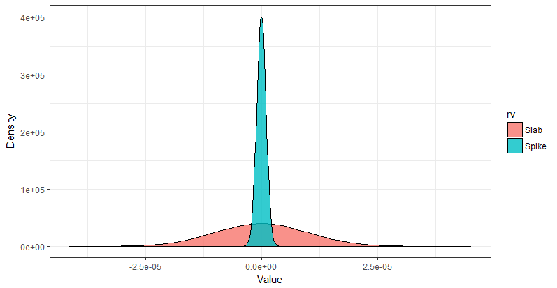

```{r setup, include=FALSE}
knitr::opts_chunk$set(fig.align = "center", fig.retina = 4, out.width = "100%")
require(knitr)
require(tidyverse)
require(rsample)
require(parsnip)
require(tidy)
```

# Outline

- What is Supervised Learning?
- Machine Learning vs Econometrics
  - Prediction/classification vs inference
- Parametrics vs Non-parametric estimation
- Classification
  - Logistic (softmax)
  - Performance measures
- Prediction
  - Regularization, shrinkage and variable selection
    - Sparsity, Ridge and LASSO regressions
  - Ensemble learning
  - Performance measures
---
# What is supervised learning?

- Broadly speaking the main two subfields of machine learning are supervised learning and unsupervised learning.
- Supervised statistical involves building statistical models $f()$ for **predicting** or **estimating** and *output* $(Y)$ based on one or more *inputs* given by the design matrix $(X)$.
$$
\hat{Y}=\hat{f}(X)
$$
---
# Why estimate $f$?

.pl[
## Prediction & classification

- In classification the goal is to predict a *class label* within a defined set of elements.
- Prediction is mostly associated with continous data.
- $\hat{f}$ could be treated as a *"black box"*, that is, we are not concerned on the form of $\hat{f}$, instead, how good this function predicts $\hat{Y}$.
- No matter how accurate $\hat{f}$ is (by choosing a statistical learning technique), there always be non reducible error term (irreducible error).
- We can improve $\hat{f}$ by choosing a more flexible form. But it has a cost!
]


.pr[
## Inference

- We want to understand the effect of $X_1,\dots, X_p$ on $Y$.
- By definition it can not be a *"black box"* function, because we need to know the exact form.
- ML statistics differentiates from Econometrics in this element.
  - Econometrics: *"the quantitative analysis of actual economic phenomena based on the concurrent development of theory and observation, related by appropriate methods of inference.*" [source](https://www.jstor.org/stable/1907538?seq=1#metadata_info_tab_contents)
  - Machine learning: *"Machine Learning is the field of study that gives computers the ability to learn without being explicitly programmed"* Arthur Samuel, 1959.
- Causal inference is getting attention from ML supporters, but there is much work to do.
]

.footnote[
The use of $\hat{}$ denote estimates.
]

---
# Econometrics vs Machine Learning: the $\hat{\beta}$ vs $\hat{y}$ dilemma

.pl[
- Many economic applications revolve around *parameter estimation*
    - Produce good estimates that unveil the true relationship between $y$ and $X$
- Machine learning algorithms are not designed for estimating purposes
    - One has to be aware of the properties and goals of the estimators, the typical parameters' interpretation (i.e. asymptotic theory least square) is no neccesary longer valid.
- Applications
    - New data for traditional questions: for instance: measuring the level of economic activity from  satellite maps using light-intensity measures.
    - Pre-processing
        - Propensity Score Matching, Linear instrumental Variables Regression, Heterogeneous treatment effects.
- ML algorithms are technically easy to use in Python or R
    - Threats: *naive interpretations!*
]

.pr[
```{r, echo=FALSE}

```
]

---
# Predicting poverty from satellite maps

<iframe width="840" align="center" height="472" src="https://www.youtube.com/embed/DafZSeIGLNE?start=92" frameborder="0" allow="accelerometer; autoplay; encrypted-media; gyroscope; picture-in-picture" allowfullscreen></iframe>

.footnote[
Sustainability and artificial intelligence lab (Stanford University)
]

---
# How to we estimate $\hat{f}$?

.pl[
## Parametric methods

- There is a reason for imposing a function form of $f$: interpretability. In econometrics the conditional expectation function $E(Y|X=x)=f(x)$, we restrict $f$ from a theoretical grounds. Nonetheless, the CEF is by default nonparametric.
- Generalized Linear Model (GLMs) assume the design matrix can be expressed as a linear combination of a set of parameters (tipically denoted as $\beta$) obtained by OLS. The estimate parameters are linear by construction, while the $X=x_i$ can be of any form or distribution, however, some transformation may be captured easier.
Example: $income=\beta_0+\beta_1 education + \beta_2 seniority$
]

.pr[
```{r, echo=FALSE, fig.cap="Parametric Linear Model. Hastie et al. 2013."}

```
]

---
# How to we estimate $\hat{f}$?

.pl[
## Non-parametric methods

- Non-parametric methods do not make explicit assumptions about the functional form of $f$.
- Avoiding the assumption of a particular functional form for f, they have the potential to accurately fit a wider range of possible shapes for f.
- Disadvantage: the amount of parameters increases drastically!
- Examples:
  - Multiple Adaptive Regression Splines: $\hat{f}(X)=\sum_{j=1}^k c_iB_i(X_j)$
  - Generalized Additive Models:  $\hat{f}(X)=s_0+\sum_{j=1}^p s_j(X_j)$
  - Random Forest
  - Neural Network
  - ...
]

.pr[
```{r, echo=FALSE, fig.cap="Non-parametric model. Hastie et al. 2013."}

```
]

---
# Trade-offs of selecting $f$

.pl[
## Interpretation wise
- The more complex (flexible) the function form, the best it will fit the design matrix data gererating process.
- The simplest a functional form is, the more interpretable are their parameters (GLM for instance), but, its fit is generally worse.

## Generalization wise
- Complex models tend to do a good job explaning the data used to estimate $f$, but it does very bad job explaining data not used in the estimation process, this is called **overfitting**.
- Complex models oftenly have **hyperparameters**, also name smoothing or complexity parameters, that cannot be estimate from the data. Examples: penalty term, width of the kernel.
- **Underfitting** happens when the model is too simple,
]

.pr[
```{r, echo=FALSE, fig.cap="Müller, Guido (2017)"}

```
]

---
# Accuracy

- In order to evaluate the performance of a statistical learning method on a given data set, we need some way to measure how well its predictions actually match the observed data.
- We are interested in the accuracy of the *unseen* data, that is, a subsample of information which has not been used to estimate $\hat{f}$.
  - In practice, one has to divide the total number of observation into **training** and **testing** subsets. The firs step is to use the **train** data and observe how good it predicts the **test** data.
  - As mentioned, complex models do a good job finding a function that captures as much variance for training design matrix, but they tend to extrapolate badly on **new information**, which make them useless.
- The fundamental problem of selecting $f$ is the trade off between **bias** and **variance**.

$$
E(Y-\hat{f}(X))^2=Var(\hat{f}(X))+[Bias(\hat{f}(X))]^2+Var(\epsilon)
$$

- Variance refers to the amount by which f ˆ would change if we estimated it using a different training data set. 
- Bias refers to the error that is introduced by approximating a real-life problem, which may be extremely complicated, by a much simpler model. 


---
# Bias variance trade-off

```{r, echo=FALSE, out.width="60%", fig.cap="James et al. 2013"}
include_graphics("img/session_7/bv.png")
```

---
# Lasso and Ridge regression

.pl[
- Least Square estimates present oftenly two inconvenients
  - Low prediction accuracy: low bias but large variance.
  - Interpretation: With a lower set of predictors is easier to visualize the *"big picture"*.
  - Subset selection can be applied following *(for)backward-stepwise selection ad-hoc methods*.
- Another alternative is to use shrinkage (regularization) techniques that penalized parameter space, and reduce the sparcity of design matrix, that is, when $N<X$.
- The goal is to reduce the space of regressors by imposing restrictions. Examples:
  - Spike and slab: In Bayesian models it is possible to impose a strong prior to shrinkage the parameter space.
  - Principal component regression
  - **Ridge and Lasso**
]

.pr[
```{r, echo=FALSE, fig.cap="Spike and Slab priors. (Poyser, 2018)"}

```
]

---

.pl[
# Ridge regression
- Shrinks the regression coefficients by imposing a penalty on their size
- The ridge coefficients minimize a penalized residual sum of squares

$$
\begin{align}
\hat{\beta}^{ridge}=&\underset{\beta}{\arg\max} \Big\{ \sum_{i=1}^N \Big(y_i-\beta_0-\sum_{j=1}^p x_{ij}\beta_j\Big)^2 + \lambda \sum_{j=1}^p\beta_j^2 \Big\} \\
  =&(X^TX+\lambda I)^{-1}X^Ty
\end{align}
$$

Here $\lambda \geq 0$ is the tuning parameter and controls the complexity of the estimation. The greater $\lambda$ the greater the shrinkage.
- As expected, scaling affects the shrinkage component, therefore is neccesary to standardize the inputs.
  - **Coefficients are no longer scale invariant**
- Ridge uses the so-called $L_2$ norm
]

.pr[
# Lasso regression

- Similar to Ridge, but instead of shrinking the coefficients with a squared rule of the the parameters, it imposes a absolute value
- The penalty is a $L_1$ norm $||$
- Solution in $y_i$ is non-linear
- Lasso does a continuous subset selection

$$
\begin{align}
\hat{\beta}^{lasso}=&\underset{\beta}{\arg\max} \Big\{ \sum_{i=1}^N \Big(y_i-\beta_0-\sum_{j=1}^p x_{ij}\beta_j\Big)^2 + \lambda \sum_{j=1}^p |\beta_j| \Big\}
\end{align}
$$
- Lasso $\lambda$ shrinkage paramets is chosen with the goal of minimizen the expected prediction error.

]

---
# Decision-tree based models

.pl[

- Decision trees are widely used models for classification and regression tasks.
- Essentially, they learn a hierarchy of if/else questions, leading to a decision.
- Tree-based methods are simple and useful for interpretation. However, they typically are not competitive with the best supervised learning approaches
- $R_1$, $R_2$, $R_3$ are known as *leaves* or *terminal nodes* of the tree
- Steps:
  - Dividing the predictor space $X_p$ into $R_1, \dots, R_J$ non-overlapping regions
  - For every observation that falls into $R_J$, take the mean of the dependent variable
- The objective is to minimize the Residual Sums of Squares of:
\begin{equation}
\sum_{j=1}^J \sum_{i \in R_j} (y_i-\hat{y}_{R_j})^2
\end{equation}

]

.pr[
```{r, echo=FALSE, out.width="50%"}
include_graphics("img/session_7/tree.png")
```
]

---
# Bagging

- Decision trees have the advantage of interpretability, however, they tend show high variance
- One way to reduce the variance is to take the average of all the predictions
- Since the actual design matrix does not change, it is not possible to take the average of inexistent samples. To solve this problem we can use **bootstrapping**
  - What bootstrap does is taking $B$ random samples with replacement from a single sample, creating several artificial samples.
- Bagging uses a boostrap rule to create seudo-training sets, then average the prediction in order to reduce the variance.

\begin{equation}
\hat{f}_{bag}(x)=\frac{1}{B}\sum_{b=1}^B \hat{f}^{*b}(x)
\end{equation}

- Eventhough bagging improves accuracy, it reduces interpretability. Nevertheless, there is one way to assess the importance of one variable: variable importance
- The process works as follows:
  - Take one variable at a time, then calculate how much the RSS decreases in each split

---
# Bagging

```{r, echo=FALSE, fig.cap="Bagging process. Géron (2017)", out.width="70%"}

```

---
# Random-forest

- Works similar as bagging, but with the difference of taking a random sample of predictors over the design matrix $X_p$
- Process:
  - Draw a bootstrap sample $Z^∗$ of size $N$ from the training data.
  - Grow a random-forest tree $T_b$ to the bootstrapped data, by recursively repeating the following steps for each terminal node of the tree, until the minimum node size $n_min$ is reached.
    - Select $m$ variables at random from the $p$ variables.
    - Pick the best variable/split-point among the $m$.
    - Split the node into two daughter nodes.

## Considerations

- There are several algorithms and tweaks to improve prediction accuracy, however, each of them deserves a whole session to be studied.
  - Boosting
  - Ensemble
  - Boosting
  - SVM
  - Neural Networks
  - ...
- For a more detailed explanation of such techniques see the [references](#references) section.

---
# Packages

- `broom`: is an attempt to bridge the gap from untidy outputs of predictions and estimations to the tidy data we want to work with.
    - `tidy`: constructs a data frame that summarizes the model’s statistical findings. This includes coefficients and p-values for each term in a regression, per-cluster information in clustering applications, or per-test information for multtest functions.
    - `augment`: add columns to the original data that was modeled. This includes predictions, residuals, and cluster assignments.
    - `glance`: construct a concise one-row summary of the model. This typically contains values such as R^2, adjusted R^2, and residual standard error that are computed once for the entire model.

- [`parsnip`](https://tidymodels.github.io/parsnip/articles/articles/Models.html)
  - It is designed to solve a specific problem related to model fitting in R, **the interface**. 
  -  Many functions have different interfaces and arguments names and parsnip standardizes the interface for fitting models as well as the return values

- `tidymodels`: Collection of modeling packages, that aim to create a common structure (similar to sklearn in Python)
- `rsample`: Classes and functions to create and summarize different types of resampling objects (e.g. bootstrap, cross-validation).
---
# Dataset

.pl[
## World Developing Indicators
```{r}
wdi <- readr::read_rds("datasets/session_7/wdi_2.rds")
glimpse(wdi)
```
]

.pr[
## Online news popularity
```{r}
news <- readr::read_rds("datasets/session_7/news.rds") %>% 
  sample_frac(.20)
```

## Wine quality
```{r}
wine_w <- readr::read_rds("datasets/session_7/wine_white.rds")
```

]

---
# Base model

```{r}
lm1 <- lm(quality~.-quality_b, data = wine_w)
```


---
# Tranining, testing, and cross-validation

```{r, out.width="60%", echo=FALSE}

```

---
# Tranining, testing, and cross-validation

```{r, out.width="60%", echo=FALSE}

```

---
# Tranining, testing, and cross-validation

```{r}
data_split <- initial_split(wine_w, prop = .7)
train_data <- training(data_split)
test_data <- testing(data_split)
```

---
# Cross-validation

```{r, warning=FALSE, eval=T}
(cv_data <- vfold_cv(train_data, v = 10) %>% 
    mutate(train=map(splits, ~training(.x))
           , validate=map(splits, ~testing(.x))
           , lm=map(train, ~lm(quality~.-quality_b, data = .x))
           , rf=map(train, ~rand_forest(mtry = 5, trees = 200) %>%
                        set_engine("ranger", importance="impurity") %>%
                        fit(quality~.-quality_b, data=.x)
                    )
    )
)
```

---
# Calculate error

.pl[
## Linear model

```{r}
lm_model <- cv_data %>%   
    mutate(pred=map2(.x=lm, .y=validate, ~predict(.x, .y) %>% 
                         as_tibble %>% 
                         set_names("pred"))
           , mae=map2_dbl(.x=pred, .y=validate
                          , ~measures::MAE(truth = .y$quality
                                           , response = .x$pred)
                          )
           , mse=map2_dbl(.x=pred, .y=validate
                          , ~measures::MSE(truth = .y$quality
                                           , response = .x$pred)
           ))
```
]

.pr[
## Random forest

```{r}
rf_model <- cv_data %>%   
    mutate(pred=map2(.x=rf, .y=validate, ~predict(.x, .y) %>% 
                         as_tibble %>% 
                         set_names("pred"))
           , mae=map2_dbl(.x=pred, .y=validate
                          , ~measures::MAE(truth = .y$quality
                                           , response = .x$pred)
                          )
           , mse=map2_dbl(.x=pred, .y=validate
                          , ~measures::MSE(truth = .y$quality
                                           , response = .x$pred)
           ))
```
]


---
# Dataset

Description: Ongoing research on university faculty perceptions and practices of using Wikipedia as a teaching resource. Based on a Technology Acceptance Model, the relationships within the internal and external constructs of the model are analyzed. Both the perception of colleagues’ opinion about Wikipedia and the perceived quality of the information in Wikipedia play a central role in the obtained model. 
Link: https://archive.ics.uci.edu/ml/datasets/wiki4HE

```{r, echo=T, warning=FALSE, message=FALSE}
data0 <- readr::read_csv2("datasets/session_7/wiki4HE.csv") %>%
  na_if(y = "?") %>% 
  mutate_if(.predicate = is.character
            , .funs = ~as.numeric(.)) %>% 
  janitor::clean_names()
```

```{r}

```


---
# Missing values

```{r, echo=F, fig.width=6, fig.height=3.5, fig.retina=3, out.width="80%"}
naniar::vis_miss(data0, cluster = T)
```

---
# Imputation

.pl[
```{r}
(miss <- map_dbl(data0, .f = ~is.na(.x) %>% sum/913) %>% 
   enframe() %>% 
   arrange(desc(value)))
```
]

.pr[
```{r, eval=FALSE}
data <- data0 %>% 
  dplyr::select(miss$name[-c(1:2)]) %>% 
  dplyr::select(sort(names(.))) %>% 
  mice::mice()
```

```{r, eval=FALSE}
# Save the data
write_rds(data %>% 
            mice::complete(1) %>% 
            as_tibble()
          , path = "datasets/session_7/wiki4HE_imp.rds")
```

]

---
# Imputation: final dataset

```{r, fig.width=6, fig.height=3.5, fig.retina=3, out.width="80%"}
(wiki <- read_rds("datasets/session_7/wiki4HE_imp.rds")) %>% 
  naniar::vis_miss()
```

---
# Imputation: final dataset

```{r, out.width="70%"}
wiki %>% 
  select(ph_d, gender, university, userwiki, yearsexp, age
         , matches(match = "[0-9]")
         ) %>% 
  DT::datatable(options = list(pageLength=10))
```


---
# Regression comparison


---
name: references
# References

- Géron, A. (2017). Hands-On Machine Learning with Scikit-Learn & TensorFlow.
- Hastie, T., Tibshirani, R., & Friedman, J. (2009). The Elements of Statistical Learning. Springer, 27(2), 83–85.
- James, G., Witten, D., Hastie, T., & Tibshirani, R. (2013). An Introduction to Statistical Learning. Springer. New York.
- Müller, A. C., & Guido, S. (2017). Introduction to machine learning with Python. O’Reilly.